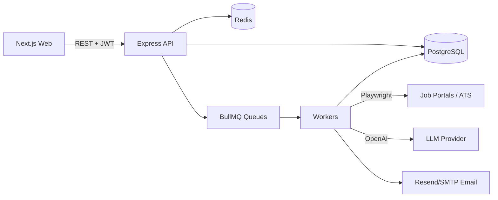

# AutoApply

```
     _         _        ___                 _       
    / \  _   _| |_ ___ / _ \ _ __  _ __ ___| | ___  
   / _ \| | | | __/ _ \ | | | '_ \| '__/ _ \ |/ _ \ 
  / ___ \ |_| | || (_) | |_| | |_) | | |  __/ | (_) |
 /_/   \_\__,_|\__\___/ \___/| .__/|_|  \___|_|\___/ 
                             |_|                     
```


Autonomous AI agent that discovers remote jobs, scores fit field-agnostically, auto-applies via browser automation, and emails you every action.

## Features
- ✅ Field-agnostic resume parsing (PDF/DOCX) into an editable structured profile
- ✅ Multi-portal scraping + job storage (even if skipped)
- ✅ LLM-based match scoring (0–100) with reasons + missing skills
- ✅ Auto-apply via Playwright with form detection + audit screenshots
- ✅ CAPTCHA detection → safe skip + user email
- ✅ Encrypted portal credentials at rest (AES-256-GCM)
- ✅ BullMQ workers for scrape/match/apply
- ✅ Dashboard UI (overview, applications, portals, profile, settings)

## Architecture



## Supported portals
| Portal | Scraping | Auto-Apply | Auth |
|---|---:|---:|---|
| LinkedIn | ✅ API | ✅ Easy Apply | OAuth 2.0 |
| JobRight.ai | ✅ Playwright | ✅ | Email/Pass |
| Mercor | ✅ Playwright | ✅ | Email/Pass |
| RemoteOK | ✅ API | ✅ Playwright | None |
| Remotive | ✅ API | ✅ Playwright | None |
| We Work Remotely | ✅ Scrape | ✅ Playwright | None |
| Himalayas | ✅ API | ✅ Playwright | None |
| Wellfound | ✅ Playwright | ✅ | Email/Pass |
| Greenhouse ATS | via apply URLs | ✅ | None |
| Lever ATS | via apply URLs | ✅ | None |
| Workday ATS | via apply URLs | ⚠️ Complex | None/Account |
| Remote.co | ✅ Scrape | ✅ Playwright | None |

## Prerequisites
- Node.js 20 LTS
- Docker Desktop (recommended)

## Quickstart (Docker) — 5 commands

```bash
cd autoapply
cp .env.example .env
docker-compose up -d
npm install
cd apps/api && npx prisma migrate dev --name init
```

Then:

```bash
cd ../..
npm run dev
```

Open `http://localhost:3000`.

## Manual setup (no Docker)
1. Install PostgreSQL 16 and Redis 7 locally
2. Create a database named `autoapply`
3. Set `DATABASE_URL` and `REDIS_URL` in `.env`
4. Install dependencies: `npm install`
5. Migrate: `cd apps/api && npx prisma migrate dev --name init`
6. Run: `npm run dev`

## Environment variables
See `.env.example`. Minimum required:
- `DATABASE_URL` (required)
- `REDIS_URL` (required)
- `JWT_SECRET` (required, min 32 chars)
- `ENCRYPTION_KEY` (required)
- `OPENAI_API_KEY` (required for LLM features)
- `RESEND_API_KEY` (or SMTP vars) for email
- `LINKEDIN_CLIENT_ID` + `LINKEDIN_CLIENT_SECRET` for LinkedIn OAuth

## How it works
1. You upload a resume (PDF/DOCX)
2. The system extracts text and parses it into a structured `UserProfile`
3. On schedule, the agent enqueues scrape jobs per connected portal
4. New jobs are stored in PostgreSQL
5. Each job is match-scored vs your profile text (0–100) + reasons
6. Above your threshold → queued for auto-apply
7. Apply worker opens the job in Playwright, detects fields, fills safely, screenshots, submits
8. Email sent immediately for success/failure/CAPTCHA/manual-required

## Field-agnostic behavior
Matching and form filling are driven by **only the job description text and your profile JSON**. No industry keywords are hardcoded; the system works across any profession.

## API documentation
Routes are implemented under `apps/api/src/routes/`.

## Add a new portal
Extend `BasePortal` and register it in `PortalRegistry`.

```ts
import { BasePortal } from "@/services/portals/BasePortal";

export class NewPortal extends BasePortal {
  readonly name = "newportal";
  readonly displayName = "NewPortal";
  readonly logoUrl = "https://example.com/logo.png";
  readonly requiresAuth = false;

  async scrapeJobs() { return []; }
  async applyToJob(job, profile, resumePath) { /* ... */ }
  async isLoggedIn() { return true; }
  async login() { return; }
}
```

## Troubleshooting
- **Redis connection errors**: ensure `docker-compose` is running and `REDIS_URL` is correct.
- **Prisma client issues**: run `npm run prisma:generate`.
- **Playwright missing browsers**: `npx playwright install` (done automatically on install in most cases).

## Legal disclaimer
Use responsibly. Respect portal terms of service and local laws. AutoApply detects CAPTCHAs but does not bypass them.

## Contributing
PRs welcome. Keep changes field-agnostic and avoid hardcoded role/industry assumptions.

## License
MIT

