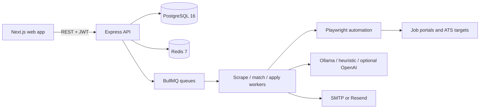

# AutoApply

```text
     _         _        ___                 _
    / \  _   _| |_ ___ / _ \ _ __  _ __ ___| | ___
   / _ \| | | | __/ _ \ | | | '_ \| '__/ _ \ |/ _ \
  / ___ \ |_| | || (_) | |_| | |_) | | |  __/ | (_) |
 /_/   \_\__,_|\__\___/ \___/| .__/|_|  \___|_|\___/
                             |_|
```


AutoApply is a production-focused monorepo for discovering remote jobs, scoring them against a user profile, and automating safe application flows across supported portals and ATS systems.

## Features
- Field-agnostic resume parsing for PDF and DOCX uploads.
- Editable structured profile storage with skills, experience, education, certifications, and languages.
- Multi-portal scraping with durable job storage even when a job is skipped.
- Free-first AI runtime: local Ollama first, deterministic fallback next, optional OpenAI support if configured.
- Match scoring with reasons, missing-skill analysis, and configurable thresholds.
- Playwright-driven form extraction, form filling, screenshots, CAPTCHA detection, and submission auditing.
- Encrypted portal credentials at rest using AES-256-GCM.
- Queue-based scrape, match, and apply workers using BullMQ and Redis.
- Next.js dashboard for onboarding, portals, applications, profile editing, and agent controls.
- Support for the 12 built-in portals plus user-added custom portal records.

## Architecture



## Supported Portals

| Portal | Scraping | Auto-Apply | Auth |
| --- | --- | --- | --- |
| LinkedIn | API | Easy Apply and external flows | OAuth 2.0 |
| JobRight.ai | Playwright | Yes | Email and password |
| Mercor | Playwright | Yes with manual skip guards | Email/password or Google flow |
| RemoteOK | Public API | Playwright | None |
| Remotive | Public API | Playwright | None |
| We Work Remotely | Scrape | Playwright | None |
| Himalayas | Public API | Playwright | None |
| Wellfound | Playwright | Yes | Email and password |
| Greenhouse ATS | Via apply URLs | Playwright | None |
| Lever ATS | Via apply URLs | Playwright | None |
| Workday ATS | Via apply URLs | Partial with manual-required handling | None or account wall |
| Remote.co | Scrape | Playwright | None |
| Custom portals | User managed | Stored and surfaced in UI/API | User defined |

## Prerequisites
- Node.js 20 LTS
- npm 10+
- Docker Desktop
- Optional: Ollama for local AI inference

## Quickstart

```bash
git clone https://github.com/hamnajamila/autoapply.git
cd autoapply
npm install
docker-compose up -d postgres redis
npm run prisma:generate
```

Then:

```bash
npm run dev
```

Open `http://localhost:3000`.

## Manual Setup

1. Copy `.env.example` to `.env`.
2. Set `DATABASE_URL`, `JWT_SECRET`, `ENCRYPTION_KEY`, and `NEXTAUTH_SECRET`.
3. If you want local AI, install and start Ollama, then pull a model such as `qwen2.5:7b-instruct`.
4. Start PostgreSQL 16 and Redis 7.
5. Run `npm run prisma:generate`.
6. Apply the schema to the database.
7. Start the app with `npm run dev`, or run `npm run build` followed by the production start commands for API and web.

## Environment Variables

| Variable | Required | Description |
| --- | --- | --- |
| `DATABASE_URL` | Yes | PostgreSQL connection string |
| `REDIS_URL` | Yes | Redis connection string |
| `JWT_SECRET` | Yes | JWT signing secret |
| `ENCRYPTION_KEY` | Yes | AES-256-GCM key seed |
| `NEXTAUTH_SECRET` | Yes | NextAuth secret |
| `LLM_PROVIDER` | No | `ollama`, `heuristic`, `openai`, or `auto` |
| `OLLAMA_BASE_URL` | No | Local Ollama server URL |
| `OLLAMA_MODEL` | No | Local Ollama model name |
| `OPENAI_API_KEY` | No | Optional paid AI fallback |
| `SMTP_HOST` | No | SMTP host for email delivery |
| `SMTP_PORT` | No | SMTP port |
| `SMTP_USER` | No | SMTP username |
| `SMTP_PASS` | No | SMTP password |
| `RESEND_API_KEY` | No | Optional Resend fallback |
| `LINKEDIN_CLIENT_ID` | No | LinkedIn OAuth client id |
| `LINKEDIN_CLIENT_SECRET` | No | LinkedIn OAuth client secret |
| `NEXT_PUBLIC_API_URL` | Yes | Browser-visible API base URL |

See [`/.env.example`](C:/Users/DELL/Desktop/AutoApply/autoapply/.env.example) for the full list.

## How It Works

1. A user registers, uploads a resume, and reviews the structured profile generated from resume text.
2. The user connects one or more supported portals and can also store custom portal entries.
3. The scheduler or manual trigger queues scrape jobs for active portals.
4. New listings are saved to PostgreSQL and deduplicated.
5. Each job is match-scored against the user profile.
6. Jobs above the configured threshold are queued for application.
7. The apply worker restores cookies, detects CAPTCHA, captures screenshots, fills forms, and attempts submission.
8. Results are stored in the application record and email notifications are sent.

## Field-Agnostic Matching

AutoApply does not assume a technical role, creative role, healthcare role, or any other fixed industry. Matching is driven by profile text, extracted skills, experience, education, and the plain text of the job description. This keeps the scoring logic usable across software, design, operations, marketing, legal, education, clinical, and other career paths.

## API Reference

Core routes live under [`/apps/api/src/routes`](C:/Users/DELL/Desktop/AutoApply/autoapply/apps/api/src/routes):
- `auth.ts`
- `profile.ts`
- `portals.ts`
- `applications.ts`
- `agent.ts`
- `dashboard.ts`

## Adding A New Portal

Extend [`BasePortal.ts`](C:/Users/DELL/Desktop/AutoApply/autoapply/apps/api/src/services/portals/BasePortal.ts) and register the class in the portal registry.

```ts
export class ExamplePortal extends BasePortal {
  readonly name = "example";
  readonly displayName = "Example Portal";
  readonly logoUrl = "https://example.com/logo.png";
  readonly requiresAuth = false;

  async scrapeJobs() {
    return [];
  }

  async applyToJob(job, profile, resumePath) {
    return { success: false, status: "SKIPPED_MANUAL", errorMessage: "Not implemented" };
  }

  async isLoggedIn() {
    return true;
  }

  async login() {
    return;
  }
}
```

## Troubleshooting

- If Prisma validation passes but migration execution fails, confirm PostgreSQL is reachable and the target schema exists.
- If the API cannot reach Redis locally, recreate the Docker Compose services so host port bindings are applied cleanly.
- If resume parsing falls back to heuristics, confirm Ollama is running or configure an optional remote provider.
- If email delivery fails in development, use SMTP settings that point to a local mail catcher or a free SMTP test account.
- If a portal returns CAPTCHA or an account-creation wall, AutoApply will skip safely and preserve the audit trail.

## Legal And Usage Notice

Use this project responsibly. Review each portal's terms of service, rate limits, and automation policies before using it against live services. The software intentionally skips CAPTCHA solving and other high-risk bypass behavior.

## Contributing

1. Create a feature branch.
2. Run `npm run typecheck`, `npm run lint`, `npm test`, and `npm run build`.
3. Add or update tests for behavior changes.
4. Open a pull request with a clear summary and verification notes.

## License

MIT
